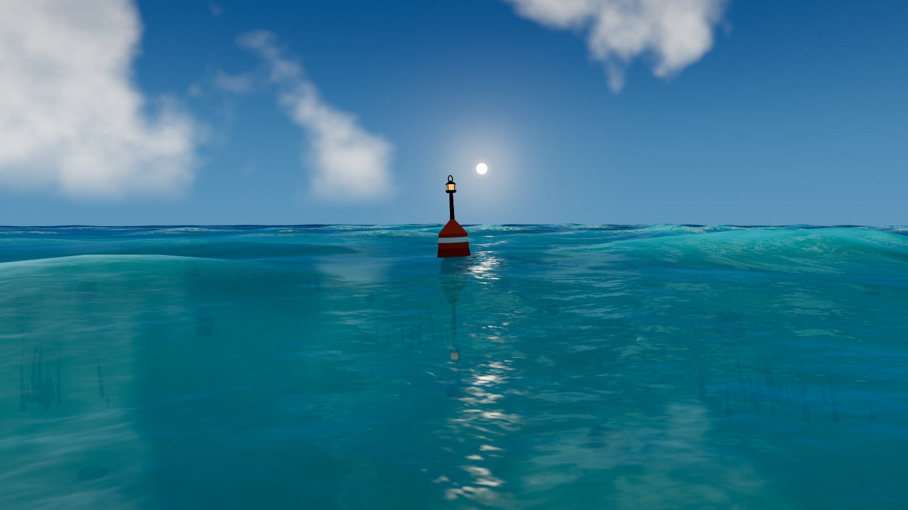

# Beautiful Water

[](https://github.com/VictorZakharov/beautiful-water/actions/workflows/ci.yml)
[](https://github.com/VictorZakharov/beautiful-water/actions/workflows/deploy-pages.yml)
[](LICENSE)

A cinematic, full-screen shallow-ocean environment rendered with Three.js. It combines a
directional procedural wave spectrum with physically grounded surface lighting, a responsive
navigation buoy, and an explorable underwater habitat.

[](https://victorzakharov.github.io/beautiful-water/)

**[Open the live demo](https://victorzakharov.github.io/beautiful-water/)**

## Features

- Broad, non-repeating directional swells with domain warping, wave packets, crest shaping,
  distance-aware detail, and a CPU sampler shared by floating objects.
- Projective reflection and refraction, Fresnel response, GGX sun glitter, shallow-water
  transmission, depth-dependent cyan-to-blue color, cloud reflections, and cloud shadows.
- Transported, lifecycle-driven foam that follows energetic crests without revealing a tiled
  wave pattern or moving as a single permanent sheet.
- A visible sun, procedural sky and clouds, natural reflection path, underwater caustics,
  volumetric sun rays, seabed vegetation, and rocks.
- A procedural navigation buoy that bobs, tilts, reflects, casts a shadow, and remains the
  camera's orbit pivot.
- Three procedural fish schools with separation, alignment, cohesion, depth avoidance,
  curiosity, habituation, and escape responses to a moving underwater camera.
- Above-water and underwater rendering states reached continuously by orbiting through the
  animated surface, plus a responsive loading screen and FPS counter.
- No downloaded scene assets: geometry, behavior, shaders, sky, noise, and habitat details are
  generated in code and released under the MIT license.

## Run locally

```bash
bun install
bun run dev
```

Open the local URL printed by Vite.

- Left mouse: orbit around the buoy
- Wheel: move toward or away from the buoy
- Orbit beneath the surface to enter the underwater environment

Panning and cursor-offset zoom are intentionally disabled so the buoy remains the stable focal
point.

## Automated visual harness

The included Playwright harness starts Vite, freezes the simulation clock, and captures twenty
named regression views at 1600 by 900 locally. GPU-less CI runs the same camera matrix at 960 by
540 through bundled Chromium and SwiftShader across two parallel shards, keeping the required
check deterministic and bounded without dropping coverage. Coverage includes:

- the sun path, cross-sun grazing angles, opposite-sun water, and top-down rendering;
- near, wide, and far-field compositions designed to expose repetition and grazing artifacts;
- foam formation, transition, replacement, and long-interval transport;
- general underwater rendering plus calm, curious, and startled fish behavior;
- loading-stage order, progress monotonicity, frame cadence, shader warm-up, and WebGL errors;
- displacement-field correlation at three simulation times to prevent periodic tiling from
  returning unnoticed.

```bash
bun run visual:test
```

Screenshots, camera and renderer diagnostics, wave-correlation measurements, and startup timing
are written to `visual-results/`. Set `PLAYWRIGHT_CHROMIUM_PATH` when Chrome or Edge is not in a
standard location.

## Production and GitHub Pages

```bash
bun run build
bun run build:pages
bun run check:pages
```

Pull requests run independent production-build and browser/WebGL checks. Merges to `main` build
the repository-scoped Pages artifact, rerun the complete visual gate, deploy through GitHub's
official Pages actions, and smoke-test the live document and JavaScript bundle.

## License

MIT -- see [LICENSE](LICENSE).
